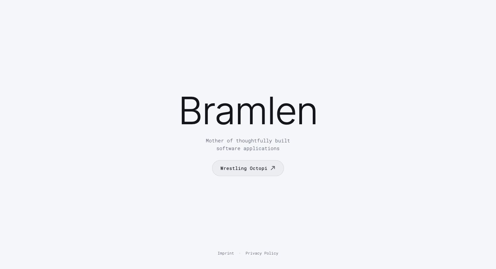

# Bramlen

The website for **Bramlen**, the software-focused branch of Half Odd.

Bramlen is where I develop software products, internal tools, automations, and digital systems - combining product thinking, interface design, and engineering from the beginning rather than treating them as separate stages.

## What Bramlen works on

Projects span:

- web applications
- internal tools and workflows
- automation
- AI-assisted products
- experimental software
- product prototyping

The goal is not to add technology for its own sake, but to build software that makes a process simpler, clearer, or more useful.

## Approach

I work across the product lifecycle:

**Problem → Product → Interface → Engineering → Testing → Iteration**

Design and development happen closely together, allowing an interaction to move from an idea into working software quickly and then be evaluated through actual use.

AI-assisted development is part of that process, but product decisions, architecture, visual judgment, testing, and final implementation remain deliberately reviewed rather than delegated blindly.

## Built with

- React
- Vite
- JavaScript / TypeScript
- CSS

## Live

[bramlen.com](https://bramlen.com/)

## Part of Half Odd

Bramlen is the software branch of [Half Odd](https://www.halfodd.com/), an independent design and technology practice by Theresa Schantz.
